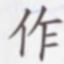
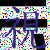
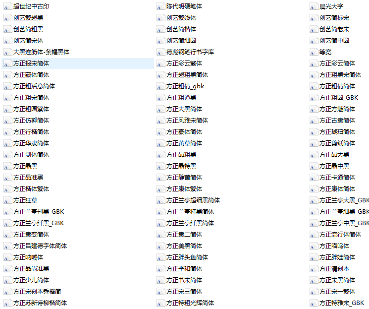

# Single_char_image_generator
This code is used to generate some synthesized text pictures with RGB channels and **perspective transform** by default to train the text classification model.

# Getting Started
- This work was tested with python 3.6,and Ubuntu 18.03. You may need to install third-party libraries by following commend. <br>
```bash
 python -m pip install -r requirements.txt
```
# Generating images
By default, simply run `python OCR_image_generator_single_ch.py` will generate a text image per word with color channels in `output/` and a labels.txt file in current folder.<br>
```bash
python OCR_image_generator_single_ch.py
```
- Example<br>


# Code function display
Adding different parameters can generate text images with different effects, as follows:<br>
| parameter  |    Example images    |
| ---         |     ---      |   
| `--blur `|     |  
| `--prydown`|      
| `--lr_motion`|   | 
| `--ud_motion`|       |
| `--noise_enable` |     | 

# About the choice of font color
In this paper, the kmeans clustering method is used to calculate the 8 cluster centers in the LAB space 
based on the background image clipped by the selected text, and then load the color library (including 9882 colors), 
and randomly select No. 500 from the color library. 

For colors, calculate the sum of the standard deviations of each color
number and the cluster centers of 8 types, and randomly select one of the first 100 colors as the font color of the generated image. 
(This can enrich the font color, of course, you can also choose the maximum standard deviation color as the font color)
 
Of course, if you know in advance what kind of font color you need, you need to generate this type of images, 
you can also use `--customize_color` parameters to customize the font color.

# Arguments
* Base argument
    * `--output_dir`: Path of output directory.
    * `--num_per_word`: Number of images per word.
    * `--output_image_size`: Size of output image.
    * `--bg_path`: The generated text pictures will use the pictures of this folder as the background.
    * `--fonts_path`: The font used to generate the picture.
    * `--chars_file`: Chars allowed to be appear in generated images.
    * `--word_false_txt_path`: Txt file generated from [check_font_validate.py](https://github.com/rachellin0105/Single_char_image_generator/blob/master/check_font_validate.py).
* Argument for choice best color
    * `--color_path`: Color font library used to generate text.
    * `--customize_color`: Support font custom color.
* Argument for data augmentation
    * `--blur`: Apply gauss blur to the generated image.
    * `--prydown`: Blurred image, simulating the effect of enlargement of small pictures.
    * `--lr_motion`: Apply left and right motion blur.
    * `--ud_motion`: Apply up and down motion blur.
    * `--config_file`: Set the parameters when rendering image.

# About font files 
In zcswdt/Color_OCR_image_generator, he sorted out about 700 fonts that can be used in generating OCR text pictures,
Downloaded Baidu Cloud Link as follows:<br>
 [here1](https://pan.baidu.com/s/1dRp70rEVeauu9rWB7bfGZw). Extraction code:8kzt.   [here2](https://pan.baidu.com/s/1aHkYSxactHm4u5eEiqHDAA). Extraction code:s58p



# Tools
* You can use `sentence_filter.py` script to select different modes(contains `filter` and `split` model) to 
filter the text and remove the text that is not in the dictionary and to cut the text of different lengths.

* You can use **`check_font_validate.py`** to check whether it wasn't written the word on the image because of the font 
and then create the txt file to list the font with the words not matching .

# Reference
- https://github.com/Sanster/text_renderer
- https://github.com/wang-tf/Chinese_OCR_synthetic_data
- https://github.com/zcswdt/Color_OCR_image_generator


